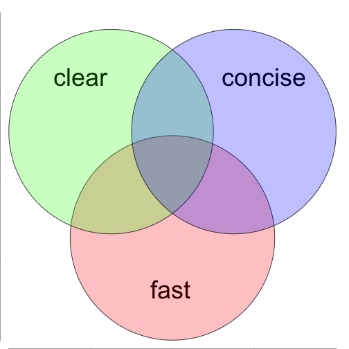
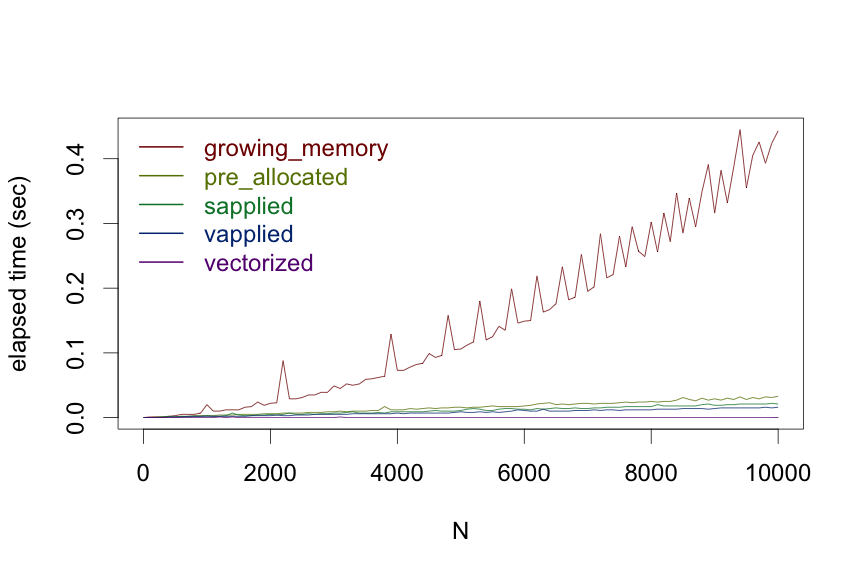
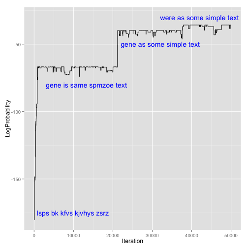
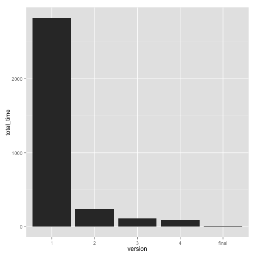

Idiomatic Optimization:  simpler, faster R code 
========================================================
author: Robert Horton, PhD, MS
date: December 8, 2014


Intended Audience
========================================================
This presentation assumes that you: 
* have some experience with R programming
* know how to decompose problems and write functions
* are familiar with the fundamental R data structures
* can write code that gives correct answers, even if it is slow
* want to make your code simpler and faster

Idiomatic Optimization
========================================================

 
***
We will look at ways to make your code shorter, easier to understand, and faster, all at the same time.

This is not premature optimization; we want to make the code concise and clear anyway.


Quiz
========================================================

Given a function like this:

```r
f <- function(n) (1 + 1/n)^n
```
What is the fastest way to run the function on a series of inputs?
* y <- numeric(); for (i in seq_along(x)) y[i] <- f(x[i])
* y <- numeric(length(x)); for (i in seq_along(x)) y[i] <- f(x[i])
* y <- sapply(x, f)
* y <- vapply(x, f, numeric(1))


Trick Question!  y <- f(x)
========================================================

```r
x <- 1:1000
```
 


Performance
========================================================


 

Case Study
========================================================

[](http://shop.oreilly.com/product/0636920018483.do)
***
* Book organized as a series of case studies presenting increasingly complex machine learning approaches
* Programming perspective, rather than straight math
* Well-known authors, respected publisher, fairly popular book
* Examples are all in R
* Code is not idiomatic

Code Breaking as an Optimization Problem
========================================================
* Toy problem: use Metropolis algorithm to solve a simple substitution cipher
    - A (secret) permutation of the alphabet has been used to encipher a message
    - Try to find the best permutation to reverse the cipher
* Uses a large dictionary of English words and their observed probability of occurrence in training text
    - look for recognizable words in output
    - score message by product of word probabilities
* Requires many iterations of testing and modification

Improvement of Scores Across Iterations
========================================================


 
***
* actual message: 
<div>"here is some sample text"</div>
* caesar cipher: "bcdefghijklmnopqrstuvwxyza"
* total iterations: 5 &times; 10<sup>4</sup>
* final decryption: 
<div>"were as some simple text"</div>

Time Comparisons
========================================================

 
***
Total time for 50000 iterations was reduced from 
43.0 minutes to 
12.9 seconds
(a 200-fold improvement).

Length of code was reduced by half.

Profiling run #1
========================================================
(50 iterations in 1.78 sec)
```
                    self.time self.pct
"one.gram.probability"   1.56    91.76
"paste"                  0.04     2.35
"rbind"                  0.02     1.18
"as.data.frame.character"0.02     1.18
"factor"                 0.02     1.18
"make.names"             0.02     1.18
"unlist"                 0.02     1.18

```

one.gram.probability
========================================================
```
one.gram.probability <- 
    function(one.gram, lexical.database=list())
{
  lexical.probability <- 
        lexical.database[[one.gram]]
...
```

`lexical.database` is a list where the keys are English words and the values are the relative frequencies of the word in a training text.

Solution #1: environment vs. list
========================================================

In a list, looking up values by key requires sequential search in a list. An environment uses hashing to find values by key in constant time.

```
LEXMAP <- new.env(size=length(lexical.database))
for (i in seq_along(lexical.database))
    LEXMAP[[ names(lexical.database)[i] ]] <- lexical.database[[i]]
```

When copying the dictionary, using an integer index into the original list with double bracket operator is dramatically faster than looking up each word by name.

Profiling run #2
========================================================
(5000 iterations in 24.26 sec)
```
                    self.time self.pct
"rbind"                  3.94    16.32
"paste"                  2.94    12.18
"match"                  2.48    10.27
"[<-.factor"             1.66     6.88
"as.vector"              1.28     5.30
"apply.cipher.to.string" 0.68     2.82
"deparse"                0.54     2.24
"levels"                 0.54     2.24

```

Problem #2: growing results a row at a time
========================================================
```
results <- data.frame()

for (iteration in 1:number.of.iterations){
  ...
  results <- rbind(results,data.frame...
```
  
Solution #2: combine all the rows at once
========================================================

```
results <- do.call("rbind", 
    lapply(1:number.of.iterations, 
        function(i){...
```

Each iteration produces a one-row data frame, and we need to bind them all together. The `rbind` function takes a series of arguments and combines them by rows. We can do the iterations using `lapply` so that the single-row data frames are in a list, then use `do.call` to run `rbind` with all the rows at once.

Profiling run #3
========================================================
(5000 iterations, 11.44 sec)
```
                     self.time self.pct
"paste"                   3.50    30.59
"substr"                  0.80     6.99
"rbind"                   0.66     5.77
"apply.cipher.to.string"  0.60     5.24
"data.frame"              0.48     4.20
"deparse"                 0.44     3.85
"make.names"              0.44     3.85
"as.data.frame"           0.36     3.15
```

Problem #3: string operations
========================================================
```
apply.cipher.to.string <- function(string, cipher)
{
  output <- ''

  for (i in 1:nchar(string))
  {
    output <- paste(output, 
        cipher[[substr(string, i, i)]], 
        sep = '')
  }
  
  return(output)
}
```

Solution #3: vapply the cipher
========================================================

```r
apply.cipher.to.text <- 
        function(text, cipher){
    encipher_vec <- function(ch_vec, cipher)
        paste(cipher[ch_vec], collapse='')
	vapply(strsplit(text,''), 
        encipher_vec, character(1), cipher)
}
```

Profiling run #4
========================================================
(5000 iterations in 9.42 sec)
```
                     self.time self.pct
"rbind"                   0.96    10.19
"paste"                   0.86     9.13
"vapply"                  0.62     6.58
"FUN"                     0.60     6.37
"strsplit"                0.52     5.52
"deparse"                 0.44     4.67
"log.probability.of.text" 0.34     3.61

```

Final Version: multiple changes
========================================================
Representing ciphers as strings instead of named vectors allows fast and simple character translation using `chartr`.

```
generate.random.cipher <- function()
    paste(sample(letters), collapse='')

alphabet <- paste(letters, collapse='')
encipher <- function(string, cipher)
        chartr(alphabet, cipher, string)
```

Collecting the results for each iteration in the corresponding row of a pre-allocated character matrix, then converting to a data frame at the end of the run, is much faster than `rbind` on single-row data frames.

Final Profiling Run
========================================================
(50000 iterations in 12.9 sec)
```
                 self.time self.pct
"chartr"              3.38    29.14
"sample.int"          1.38    11.90
"mget"                1.26    10.86
"unlist"              1.06     9.14
".External"           0.80     6.90
"c"                   0.70     6.03
"paste0"              0.66     5.69
"break_cipher"        0.38     3.28
"paste"               0.34     2.93
"sample"              0.30     2.59
```

Idioms in R
========================================================
* Process data by batch, not by item
    - <span style="color:#800">Orchestrate computation</span>: declarative, not imperative
        + Call a solver: `solve(A,b)`, `optim()`, `ode(...)`
        + Use vector (or matrix) operations: `sqrt(vec)`, `%*%`
    - Avoid growing data structures in memory
* R has a rich vocabulary. Use it.
    - Use available functions / packages
    - Use appropriate data structures

_Idiomatic R can be concise, readable, and fast._

Session Info
========================================================

```
R version 3.1.1 (2014-07-10)
Platform: x86_64-apple-darwin10.8.0 (64-bit)

locale:
[1] en_US.UTF-8/en_US.UTF-8/en_US.UTF-8/C/en_US.UTF-8/en_US.UTF-8

attached base packages:
[1] stats     graphics  grDevices utils     datasets  methods   base     

other attached packages:
[1] microbenchmark_1.4-2 ggplot2_1.0.0        knitr_1.6           

loaded via a namespace (and not attached):
 [1] codetools_0.2-9  colorspace_1.2-4 digest_0.6.4     evaluate_0.5.5  
 [5] formatR_1.0      grid_3.1.1       gtable_0.1.2     labeling_0.3    
 [9] MASS_7.3-34      munsell_0.4.2    plyr_1.8.1       proto_0.3-10    
[13] Rcpp_0.11.2      reshape2_1.4     scales_0.2.4     stringr_0.6.2   
[17] tools_3.1.1     
```
