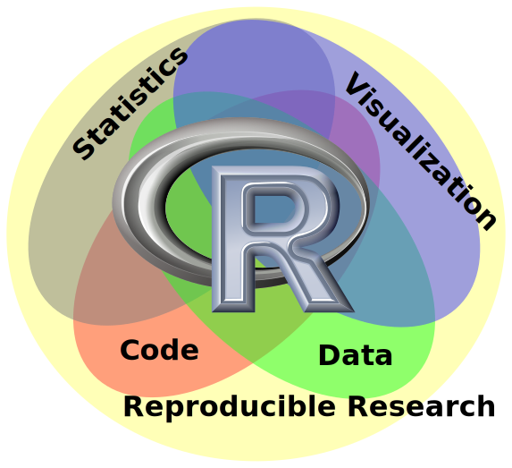

Teach Yourself R
========================================================
author: Bob Horton
date: 12/24/2014


R has many aspects
========================================================


***
* powerful synergy
* you can't learn everything at once


Platform for Reproducible Research
========================================================


***
* open source
    - freely available
    - attractive for students and academics
    - common platform
* RMarkdown / RStudio


The many faces of R
========================================================


***

* programming language vs. interactive environment
    - `sapply` vs `vapply`
* generic functions
* packages add capabilities
* language extensions
    - operator overloading
    - `dplyr` uses `%>%` for pipelining


Be an Optimist
========================================================

***
* find details you understand, figure out what they can tell you
* computing super powers; demonstration vs. proof


The R Programming Language
========================================================
The Usual Things
* data types
* data structures
* functions
* flow control
* indentation is just for readability (Python is weird)

The R Programming Language
========================================================
The Unusual Things
* vectorization
* simplification
* functional paradigm
* lexical scoping (closures)
* math and statistics resources
    - matrices, complex numbers
        + `sqrt(-1+0i)`
    - random numbers from specified distributions
    - `sample(), choose(), seq(), integrate(), %*%, :,` etc

Data Types
========================================================
Vector Types
* raw
* __logical__
* __integer__
* __numeric__ (double-precision floating point)
* complex
* __character__
* list

"__factor__" is an encoding as an enumerated type

See `?typeof`


Data Structures
========================================================
* __vector__: every data type is at least a vector
    - array: a vector with dimension attributes
    - matrix: a 2 dimensional array
* __list__: a vector of references; recursive
* __data frame__: a list of vectors

Character Strings
========================================================

```r
drugs <- c("Indomethacin, 50mg", "Loratadine, 10mg")
strsplit(drugs, ', ')
```

```
[[1]]
[1] "Indomethacin" "50mg"        

[[2]]
[1] "Loratadine" "10mg"      
```

How do you pull out one word from a string?

```r
strsplit("Has Hal had hemorrhoids, hangnails or halitosis?", "\\W+")[[1]][7]
```

```
[1] "halitosis"
```

Character Strings
========================================================
Neglected Tropical Diseases

```r
NTDs <- c("onchocerciasis", "trypanosomiasis", "filariasis")
length(NTDs)
```

```
[1] 3
```

```r
nchar(NTDs)
```

```
[1] 14 15 10
```

Functions
========================================================
* arguments
    - can have names, default values
    - elipses (...) capture arbitrary additional arguments
* result of last statement is returned implicitly
* can be
    - assigned to named variables
    - anonymous
    - stored in data structures
    - passed as arguments to other functions
    - returned as values from other functions

See examples under `help("function")`

Ellipses
========================================================


```r
lplot <- function(...) plot(..., type="l")
```

Ellipses
========================================================

```r
plot(sqrt(1:10))
```

 

***


```r
lplot(sqrt(1:10))
```

 

Flow control
========================================================
* if (__condition__) __expression__
* if (__condition__) __expression1__ else __expression2__
* for (var in seq) __expression__
* while(__condition__) __expression__
* repeat __expression__
* break
* next

Condtional Vector Construction
========================================================
`ifelse` returns a vector combining elements from two alternatives depending on a test.

```r
age <- 15:20
ifelse (age < 18, "juvenile", "adult")
```

```
[1] "juvenile" "juvenile" "juvenile" "adult"    "adult"    "adult"   
```


Subsetting Vectors
========================================================
by name

```r
sex <- c(m ="Male", f="Female")
sex[c('m', 'f', 'f')]
```

```
       m        f        f 
  "Male" "Female" "Female" 
```

Subsetting Vectors
========================================================
by logical vector

```r
ints <- 1:10
ints[ints %% 3 == 0]
```

```
[1] 3 6 9
```

Subsetting Vectors
========================================================
by position

```r
LETTERS[1:3]
```

```
[1] "A" "B" "C"
```

Subsetting Lists
========================================================

```r
patient <- list(name="Bob", temps=c(98.6, 99,0, 101,1))
patient[1]
```

```
$name
[1] "Bob"
```

```r
patient[[1]]
```

```
[1] "Bob"
```

```r
patient$name
```

```
[1] "Bob"
```

Subsetting Matrices
========================================================

```r
M <- matrix(1:12, nrow=3)
M
```

```
     [,1] [,2] [,3] [,4]
[1,]    1    4    7   10
[2,]    2    5    8   11
[3,]    3    6    9   12
```

```r
M[2,3]
```

```
[1] 8
```

```r
M[2,]
```

```
[1]  2  5  8 11
```

Data Frames
========================================================

```r
patients <- data.frame(
    name = c("Ada", "Bob", "Cora"),
    age = c(79, 49, 19),
    sex = c("F", "M", "F")
)
rownames(patients) <- c("oma","dad","kid")

patients
```

```
    name age sex
oma  Ada  79   F
dad  Bob  49   M
kid Cora  19   F
```

Data Frame: a List of Vectors (+ attributes)
========================================================

```r
patients["name"]
```

```
    name
oma  Ada
dad  Bob
kid Cora
```

```r
patients[["name"]]
```

```
[1] Ada  Bob  Cora
Levels: Ada Bob Cora
```

***


```r
patients[1,"age"]
```

```
[1] 79
```

```r
patients
```

```
    name age sex
oma  Ada  79   F
dad  Bob  49   M
kid Cora  19   F
```

Subsetting Data Frames
========================================================

```r
patients[patients$age > 65,]
```

```
    name age sex
oma  Ada  79   F
```
Can also subset by 

* row and column indexes (like a matrix).


Vectorized functions
========================================================

```r
plot(choose(20,0:20))
```

 

Functional paradigm
========================================================
* First-class functions can be:
    - assigned to variables
    - passed as parameters
    - returned as values
    - stored in data structures
* Declarative style
    - implicit loops


Hello Functional Programming
========================================================

```r
lapply(patients, class)
```

```
$name
[1] "factor"

$age
[1] "numeric"

$sex
[1] "factor"
```

```r
sapply(patients, typeof)
```

```
     name       age       sex 
"integer"  "double" "integer" 
```


Closures
========================================================
Functions remember the environment where they were defined.

```r
counter_factory <- function(){
    i <- 0
	list(getNext=function(){
            i <<- i + 1
            i
    })
}

counterA <- counter_factory()
counterB <- counter_factory()
c(counterA$getNext(), counterA$getNext(),
  counterB$getNext(), counterA$getNext())
```

```
[1] 1 2 1 3
```

Teach Yourself R
========================================================
* Books
    - user perspective: R in Action
    - programming perspective: Advanced R
* Online Help
    - `help("purl")` (or `?purl`)
    - `vignette("hcl-colors", package="colorspace")`
* Web
    - StackOverflow, rseek, tutorials
    - Coursera (_Data Science_ Specialization)
* swirl


Objectives
========================================================
* Be able to explain each of the following concepts and describe how they affect R programming:
    - math, statistics, graphics, and data-management capabilities
    - vectorization
    - functional programming
    - generic functions
* List some reference and tutorial resources for learning R
* See how RMarkdown facilitates literate programming (e.g., by examining the source code for this presentation)

Review Questions
========================================================

What are the types of these variables?

```r
f <- sqrt
x <- 1:20
y <- f(x)
z <- x^2
d <- data.frame(x, y, z)
```

What happens with each of these function calls?

```r
plot(x, y)
plot(y)
plot(f)
plot(x, f(x))
plot(d)
```


Homework Exercise
========================================================
What does this function do?


```r
function(N) {
  x <- runif(N)
  y <- runif(N)
  4 * sum( (x^2 + y^2) < 1 )/N
}
```

* How would you give it a name?
* What is the type of the parameter `N`? (hint: see `?runif`)
* How can you call this function to see what happens?
* What is the type of the argument to `sum()`?
* What would you name it?


Assignment
========================================================
(in order of priority)
* Install R and RStudio on your computer.
* Register for "The Data Scientist's Toolbox" on Coursera.
* Set up an account on github, and email the link to Bob.
* Work on the exercise from the previous slide (don't spend more than 10 minutes).
* Download the source file for this presentation, load it into RStudio and look over the RMarkdown code.
* Read Chapter 1 of _R in Action_

