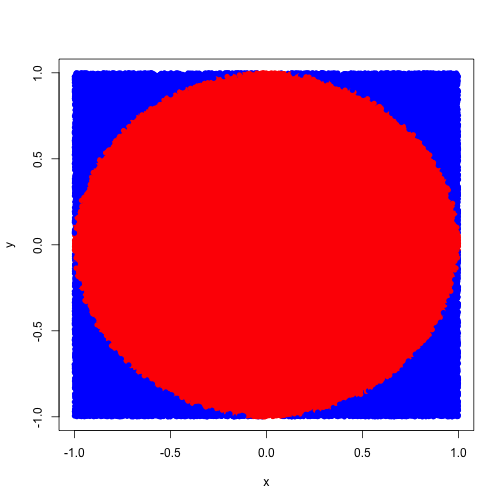
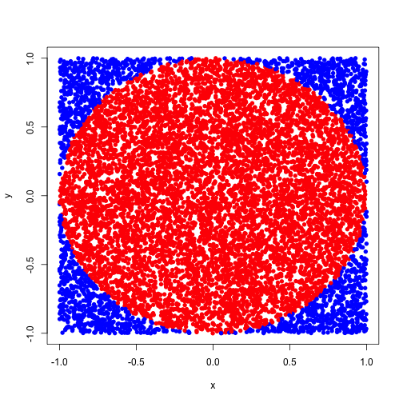
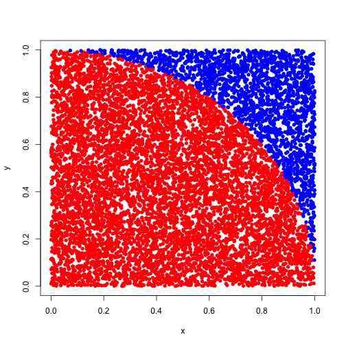
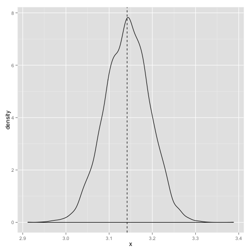

Literate Programming
========================================================
author: Bob Horton
date: 12/30/2-14


Homework Exercise Review
========================================================
Unit circle
$$ r = 1 $$
$$ A_{circle} = \pi r^2 == \pi $$
$$ A_{square} = (2 r) ^ 2 == 4 $$

 

Homework Exercise Review
========================================================

```r
N <- 10000
x <- runif(N, min=-1.0, max=1.0)
y <- runif(N, min=-1.0, max=1.0)
plot(x, y, pch=16, col=ifelse(x^2 + y^2<1, "red", "blue"))
```

 

Homework Exercise Review
========================================================

```r
N <- 10000
x <- runif(N)
y <- runif(N)
plot(x, y, pch=16, col=ifelse(x^2 + y^2<1, "red", "blue"))
```

 


Homework Exercise Review
========================================================

```r
estimate_pi <- function(N) {
    x <- runif(N)
    y <- runif(N)
	4 * sum( (x^2 + y^2) < 1 )/N
}
estimate_pi(100000)
```

```
[1] 3.14252
```

Homework Exercise Review
========================================================


```r
estimated_pi <- sapply(1:10000, function(i) estimate_pi(1000))
```
 

The average value of many runs (3.1416652) is very close to $\pi$.

Today's Objectives
========================================================
* Use RStudio/RMarkdown to document a solution to a simple estimation problem.
* Be able to embed a plot or graphic generated by code in an RMarkdown document.
* Use simple $\LaTeX$ formatting to typeset a mathematical equation in an RMarkdown document.
* Explain why a free and open source programming language is particularly well suited to making analyses reproducible.


Assignment
========================================================
* Read the document [How to Check Your Calculus Homework](`calcCheck1.pdf`).
* Download the [source file](calcCheck1.Rmd) for that document, open it in RStudio, and examine the code.
* Choose one of the problems from the [calculation exercises](calculation_exercises.md) page or (better yet) make up your own, and write up a solution as a 1-page "literate calculation"" document in RStudio.
* Be sure you include at least one plot, and at least one mathematical formula typeset in $\LaTeX$.
* Post your literate calculation document to your github account, and submit the URL for grading.
