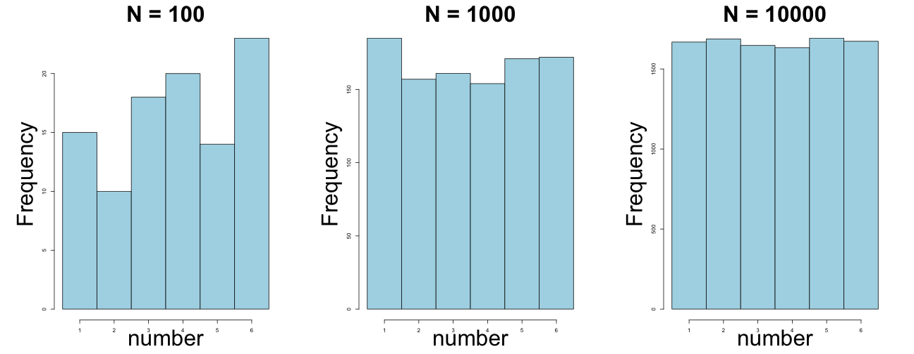
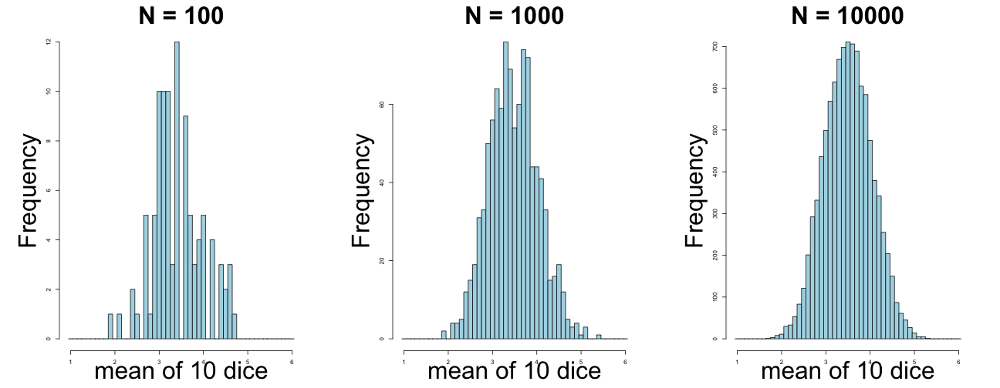
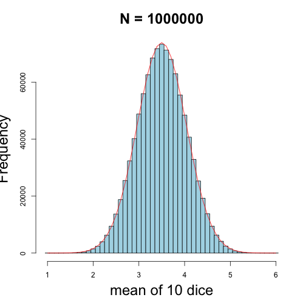

The Normal Distribution
========================================================
author: StatsCamp
date: July 2014


      
Random Sampling
========================================================
Rolling a six-sided die takes a random sample of the numbers from 1 through 6. This is a simulation of rolling one D6 die 1000 times:

```r
N <- 1000
die_rolls <- sample(1:6, N, replace=TRUE)
```

Uniform Distribution
========================================================
Assuming the die is fair, each number should be equally likely to come up in each roll. The more times you roll the die, the closer the observed results should come to this theoretical distribution.
 

Multiple Die Rolls
========================================================
Instead of rolling one die at a time and recording the number that comes up, let's roll 10 dice and record the mean of all 10 numbers. Here is a function to simulate rolling a set of dice a given number of times:


```r
roll_dice <- function(nDice, nRolls){
  matrix(
    sample(1:6, nDice*nRolls, replace=T), 
    ncol=nDice)
}
```

Multiple Die Rolls
========================================================
We can roll 10 dice three times like this:

```r
res <- roll_dice(NUM_DICE, 3)
kable(res,"html")
```

<table>
<tbody>
  <tr>
   <td style="text-align:right;"> 1 </td>
   <td style="text-align:right;"> 6 </td>
   <td style="text-align:right;"> 4 </td>
   <td style="text-align:right;"> 5 </td>
   <td style="text-align:right;"> 1 </td>
   <td style="text-align:right;"> 5 </td>
   <td style="text-align:right;"> 2 </td>
   <td style="text-align:right;"> 6 </td>
   <td style="text-align:right;"> 3 </td>
   <td style="text-align:right;"> 1 </td>
  </tr>
  <tr>
   <td style="text-align:right;"> 6 </td>
   <td style="text-align:right;"> 2 </td>
   <td style="text-align:right;"> 3 </td>
   <td style="text-align:right;"> 6 </td>
   <td style="text-align:right;"> 4 </td>
   <td style="text-align:right;"> 6 </td>
   <td style="text-align:right;"> 5 </td>
   <td style="text-align:right;"> 4 </td>
   <td style="text-align:right;"> 3 </td>
   <td style="text-align:right;"> 4 </td>
  </tr>
  <tr>
   <td style="text-align:right;"> 2 </td>
   <td style="text-align:right;"> 3 </td>
   <td style="text-align:right;"> 6 </td>
   <td style="text-align:right;"> 2 </td>
   <td style="text-align:right;"> 3 </td>
   <td style="text-align:right;"> 4 </td>
   <td style="text-align:right;"> 3 </td>
   <td style="text-align:right;"> 5 </td>
   <td style="text-align:right;"> 1 </td>
   <td style="text-align:right;"> 1 </td>
  </tr>
</tbody>
</table>
The results are in a matrix with one row per roll, and one column per die.

Multiple Die Rolls
========================================================
Now we can take the mean of each roll of 10 dice:

```r
rmeans <- data.frame(res, mean=rowMeans(res))
kable(rmeans, "html")
```

<table>
 <thead>
  <tr>
   <th style="text-align:right;"> X1 </th>
   <th style="text-align:right;"> X2 </th>
   <th style="text-align:right;"> X3 </th>
   <th style="text-align:right;"> X4 </th>
   <th style="text-align:right;"> X5 </th>
   <th style="text-align:right;"> X6 </th>
   <th style="text-align:right;"> X7 </th>
   <th style="text-align:right;"> X8 </th>
   <th style="text-align:right;"> X9 </th>
   <th style="text-align:right;"> X10 </th>
   <th style="text-align:right;"> mean </th>
  </tr>
 </thead>
<tbody>
  <tr>
   <td style="text-align:right;"> 1 </td>
   <td style="text-align:right;"> 6 </td>
   <td style="text-align:right;"> 4 </td>
   <td style="text-align:right;"> 5 </td>
   <td style="text-align:right;"> 1 </td>
   <td style="text-align:right;"> 5 </td>
   <td style="text-align:right;"> 2 </td>
   <td style="text-align:right;"> 6 </td>
   <td style="text-align:right;"> 3 </td>
   <td style="text-align:right;"> 1 </td>
   <td style="text-align:right;"> 3.4 </td>
  </tr>
  <tr>
   <td style="text-align:right;"> 6 </td>
   <td style="text-align:right;"> 2 </td>
   <td style="text-align:right;"> 3 </td>
   <td style="text-align:right;"> 6 </td>
   <td style="text-align:right;"> 4 </td>
   <td style="text-align:right;"> 6 </td>
   <td style="text-align:right;"> 5 </td>
   <td style="text-align:right;"> 4 </td>
   <td style="text-align:right;"> 3 </td>
   <td style="text-align:right;"> 4 </td>
   <td style="text-align:right;"> 4.3 </td>
  </tr>
  <tr>
   <td style="text-align:right;"> 2 </td>
   <td style="text-align:right;"> 3 </td>
   <td style="text-align:right;"> 6 </td>
   <td style="text-align:right;"> 2 </td>
   <td style="text-align:right;"> 3 </td>
   <td style="text-align:right;"> 4 </td>
   <td style="text-align:right;"> 3 </td>
   <td style="text-align:right;"> 5 </td>
   <td style="text-align:right;"> 1 </td>
   <td style="text-align:right;"> 1 </td>
   <td style="text-align:right;"> 3.0 </td>
  </tr>
</tbody>
</table>
- If we roll one die many times, what do you expect the mean to be?
- If we roll 10 dice many times, what do you think the mean of the means will be? 

Mean of rolling 10 dice at a time
========================================================
Here are the means from 8 rolls of 10 dice:

```
[1] 2.9 2.8 3.2 4.9 3.4 3.1 4.9 2.6
```
- Note that all the values are exact to one decimal point. Why?
- What is the smallest possible mean of rolling 10 dice? 
- What is the largest possible mean? 
- How many different ways can you roll the dice to get the smallest (or largest) mean value?
Multiple Die Rolls
========================================================

```r
Ntot <- 1e6
mean(roll_dice(Ntot, 1))
```

```
[1] 3.500639
```

```r
mean(roll_dice(NUM_DICE, Ntot/NUM_DICE))
```

```
[1] 3.500313
```

Distribution of the mean of rolling 10 dice many times
========================================================

 

Here the experiment of rolling 10 dice was repeated 100 times, and the averages from all the experients are plotted as a histogram. Note the "bell-shaped" distribution, and that it gets smoother with larger N.

Approximating the Normal Distribution
========================================================

 

How to Plot a Bell Curve
========================================================


```r
x <- seq(-3, 3, by=0.1)
plot(x, exp(-x^2))
```

 

The Normal Distribution
========================================================

Probability Density Function

$$
f(x) = \frac{1}{\sigma\sqrt{2\pi}} e^{ -\frac{(x-\mu)^2}{2\sigma^2} }
$$

[source](http://www.josegaert.com/blog/displaying-mathematical-formulas-in-svg-edit)

The Normal Distribution
========================================================


```r
f <- function(x, mu=0, sd=1)
  1/(sd*sqrt(2*pi))*exp(-(1/2)*((x-mu)/sd)^2)

x <- seq(-3, 3, by=0.01)
plot(x, f(x), type='l')
```

 

The Central Limit Theorem
========================================================

The distribution of the means of a set of random samples is approximately Normal, if the number of samples is large enough, regardless of the distribution of the samples themselves.
