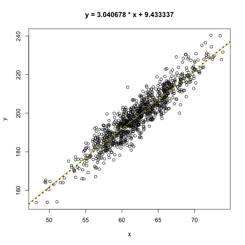

Loading and Cleaning Data
========================================================
author: Bob Horton
date: 2015-02-22

Tabular Data in Files
========================================================

The most common data structure for analysis is a rectangular table with observations in rows and attributes in columns.

- spreadsheets
- relational databases
- lowest common denominator: CSV

read.table
========================================================
Loads a text file into a data frame. Each line goes into its own row, with columns separated by a particular character. Commonly used wrappers:

* read.csv
  - comma-separated values
* read.delim
  - tab-delimited

Reading a CSV File
========================================================


```r
sse <- read.csv("spread_sheet_example.csv")
fit <- lm(y ~ x, data=sse)
with(sse, plot(x,y))
abline(fit, lty=3, lwd=3, col="red")
title(main=sprintf("y = %f * x + %f", coef(fit)[2], coef(fit)[1]))
abline(12,3,col="green")
```

 

Entering Data (semi-) Manually
========================================================

data.entry
edit.data.frame

edit and data.entry require X11


Toxic Text
========================================================


```r
toxic <- read.csv("toxic_text.csv")
```

|open_date  |  n1|  n2|n3  |name |f1    |f2 |f3 |f4    |
|:----------|---:|---:|:---|:----|:-----|:--|:--|:-----|
|2000-01-28 | 1.1| 1.1|1.1 |Alan | TRUE |T  |Y  | TRUE |
|2000-01-29 | 2.1| 2.1|2.1 |Carl |FALSE |F  |N  |FALSE |
|2000-01-30 | 3.1| 3.1|3.1 |Dora | TRUE |T  |Y  | TRUE |
|2000-01-31 | 4.1| 4.1|4.1 |Erin |FALSE |F  |N  |FALSE |
|2000-02-01 | 5.1|  NA|UNK |Fred | TRUE |?  |Y  | TRUE |

Missing Values
========================================================

toxic <- read.csv("toxic_text.csv")

Missing Values
========================================================

```r
less_toxic <- read.csv("toxic_text.csv", na.strings=c("UNK", "?"))
```

|          |toxic   |less_toxic |
|:---------|:-------|:----------|
|open_date |factor  |factor     |
|n1        |numeric |numeric    |
|n2        |numeric |numeric    |
|n3        |factor  |numeric    |
|name      |factor  |factor     |
|f1        |logical |logical    |
|f2        |factor  |logical    |
|f3        |factor  |factor     |
|f4        |logical |logical    |

Converting Dates
========================================================


```r
datecols <- which(grepl("date$", colnames(toxic)))
for (dc in datecols) toxic[[dc]] <- as.Date(toxic[[dc]])
```

colClasses
========================================================


```r
setClass("yn_flag")

setAs("character","yn_flag", function(from) c(T=TRUE, F=FALSE)[chartr("YN", "TF", from)] )

cc <- c("Date", "numeric", "numeric", "numeric", "character", "logical", "logical", "yn_flag", "logical")

non_toxic <- read.csv("toxic_text.csv", na.strings=c("UNK", "?"), colClasses=cc)
```

stringsAsFactors
========================================================


```r
tox4 <- read.csv("toxic_text.csv", stringsAsFactors=FALSE)
class(tox4$name)
```

```
[1] "character"
```

Reading a Hard-coded Block of Text
========================================================


```r
emails <- c("name,email
bob,rmhorton@usfca.edu
bill, bill@microsoft.com")

read.csv(textConnection(emails))
```

```
  name               email
1  bob  rmhorton@usfca.edu
2 bill  bill@microsoft.com
```

Fixed-Width Text
========================================================


```r
line1 <- readLines("fixed_width.txt", 1)
g <- gregexpr(" +", line1)[[1]]
widths <- diff(c(1, g + attributes(g)$match.length, nchar(line1)+1))
colnames <- strsplit(line1, " +")[[1]]
fwf <- read.fwf("fixed_width.txt", widths=widths, col.names=colnames, skip=1)
fwf$full_name <- gsub(" +$", "", fwf$full_name)
fwf
```

```
    full_name height weight systolic diastolic
1 Abe Ableson     61    180      130        90
2   Ben Baker     59    145      120        80
```
