Graphics Menagerie
========================================================
author: Bob Horton
date: 4/2/2015


Standard types of plots
========================================================
Plots can be categorized by characteristics of the variables:

- Discrete vs. Continuous
- Number of variables
  + univariate
  + bivariate
  + more than 2

Base Graphics - Formula Interface
========================================================


```r
N <- 100
df <- data.frame(
  num1 = runif(N, min=0, max=10),
  num2 = runif(N, min=0, max=10),
  cat1 = sample(LETTERS[1:5], N, replace=T),
  cat2 = sample(letters[1:5], N, replace=T)
)
kable(head(df))
```


|      num1|     num2|cat1 |cat2 |
|---------:|--------:|:----|:----|
| 6.4531998| 4.672754|C    |e    |
| 0.1222506| 2.314665|B    |c    |
| 0.1541922| 5.554767|C    |a    |
| 8.0005447| 9.680428|C    |b    |
| 4.1147863| 1.297650|B    |a    |
| 6.5072518| 6.662385|C    |b    |

Numeric vs. Numeric
========================================================

```r
plot(num1 ~ num2, data=df)
```

 

Numeric vs. Factor
========================================================

```r
plot(num1 ~ cat1, data=df)
```

 

Factor vs. Numeric 
========================================================

```r
plot(cat1 ~ num1, data=df)
```

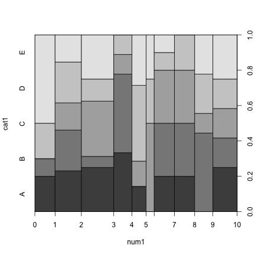 

Factor vs. Numeric Factor
========================================================

```r
plot(cat1 ~ as.factor(floor(num1)), data=df)
```

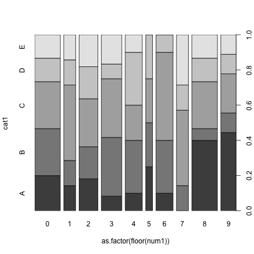 

Flu Season
========================================================


Flu Season
========================================================


```
        date     rate month_num month season year
1 1990-10-02 5.791783        10   Oct   fall 1990
2 1990-10-03 7.341260        10   Oct   fall 1990
3 1990-10-04 5.565334        10   Oct   fall 1990
4 1990-10-05 7.176974        10   Oct   fall 1990
5 1990-10-06 7.581741        10   Oct   fall 1990
6 1990-10-07 6.504430        10   Oct   fall 1990
```

Flu Rate by Date
========================================================

```r
plot( rate ~ date, data=flu)
```

 

Flu Rate by Month Number
========================================================

```r
plot( rate ~ month_num, data=flu)
```

 

Flu Rate by Month
========================================================

```r
plot( rate ~ month, data=flu)
```

 


Base Graphics - Specialized Plots
========================================================

2d Density Plot
========================================================

```r
with(flu, smoothScatter(date, rate))
```

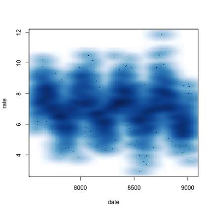 

2d Density Plot with Transformation
========================================================

```r
with(flu, smoothScatter(date, rate, transformation=exp))
```

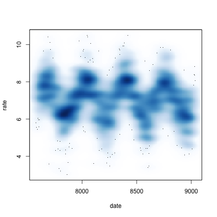 

Corrgrams
========================================================

```r
N <- 1e2  # 1e5

a <- runif(N, min=0, max=10)
b <- runif(N, min=0, max=10)
y <- 6 + 0.7 * a + 1.2 * b + rnorm(N, sd=0.2)

df2 <- data.frame(
  a1 = a + rnorm(N),
  a2 = a + rnorm(N), 
  a3 = a + rnorm(N), 
  a3 = a + rnorm(N), 
  b1 = b + rnorm(N), 
  b2 = b + rnorm(N), 
  b3 = b + rnorm(N), 
  b4 = b + rnorm(N), 
  y
)
```

Corrgrams
========================================================

```r
library(corrgram)
corrgram(df2, order=TRUE, 
    lower.panel=panel.shade, upper.panel=panel.pts, 
    text.panel=panel.txt, main="Corrgram")
```

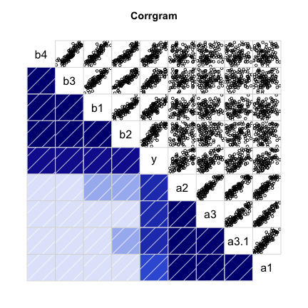 

Heatmap
========================================================

```r
heatmap(as.matrix(df2))
```

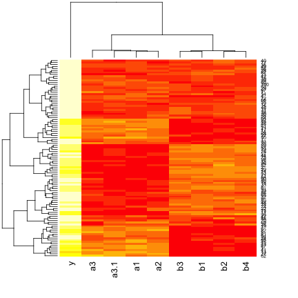 

ggplot2  - The Grammar of Graphics
========================================================
Powerful, flexible system
* mini-language for graphics
* multiple layers from different data sources
* save plot objects
* custom themes
* automated legends
* customizable smoothers (loess, linear models)
* visual perspective

Scattergram
===

```r
library(ggplot2)
g <- ggplot(data=flu, mapping=aes(x=date, y=rate)) + geom_point()
g
```

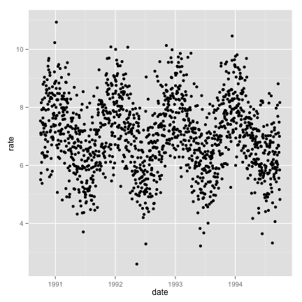 

Add to a plot
===

```r
g + geom_smooth(method="loess", span=0.1, col="red")
```

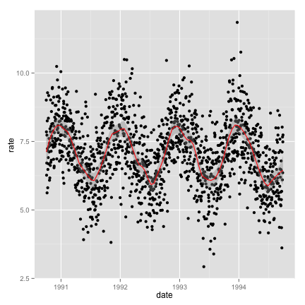 

Change Themes
===

```r
g + theme_bw()
```

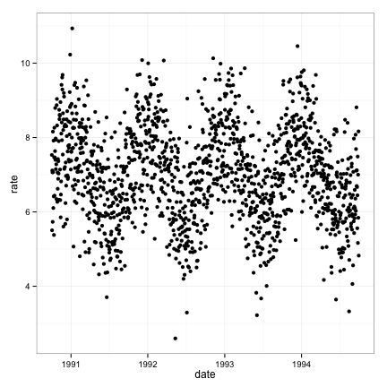 

Get More Themes
===
```
library(devtools)
install_github("jrnold/ggthemes")
```

The Economist Theme
===

```r
library(ggthemes)
g + theme_economist()
```

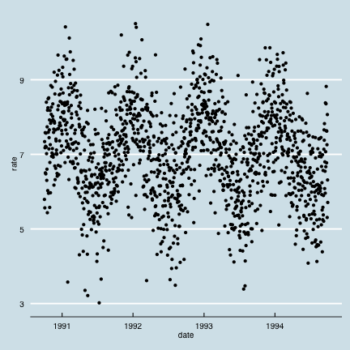 

Wall Street Journal Theme
===

```r
g + theme_wsj()
```

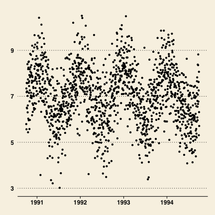 

Boxplot
===

```r
g2 <- ggplot(flu, aes(x=month, y=rate))
g2 + geom_boxplot()
```

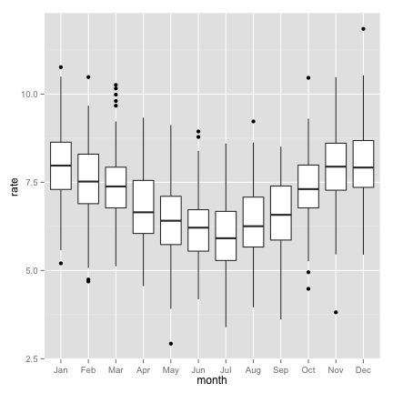 

Adjust Elements of Theme
===

```r
g2 + geom_boxplot() + theme(axis.text.x=element_text(angle=50, size=20, vjust=0.5))
```

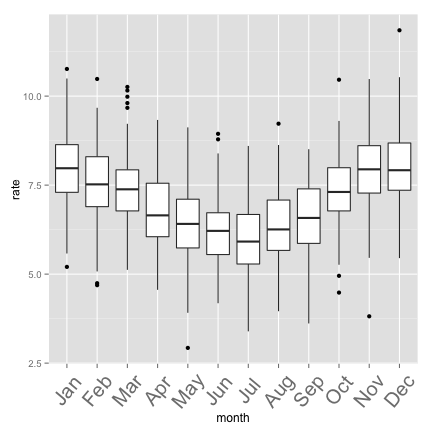 

Violin Plot
===

```r
g2 + geom_violin(alpha=0.5, color="gray")
```

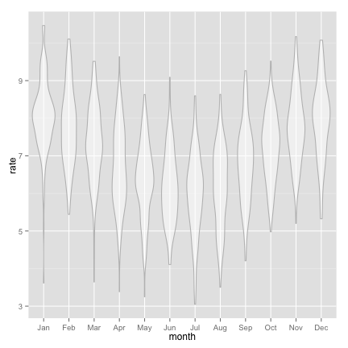 

Automatic legends
===

```r
g3 <- ggplot(flu, aes(x=date, y=rate, col=season)) + geom_point()
g3
```

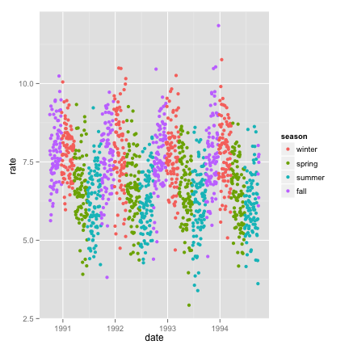 

Faceting
===

```r
g3 + facet_grid( . ~ month)
```

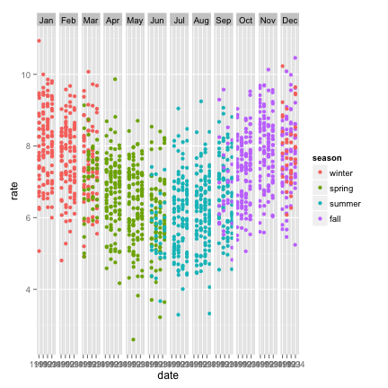 

Faceted the other way
===

```r
g3 + facet_grid(month ~ .)
```

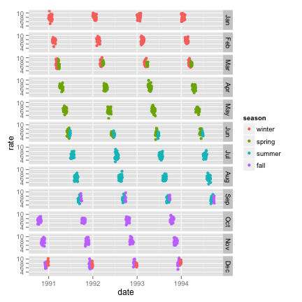 

Faceted Two Ways
===

```r
g3 + facet_grid(year ~ month)
```

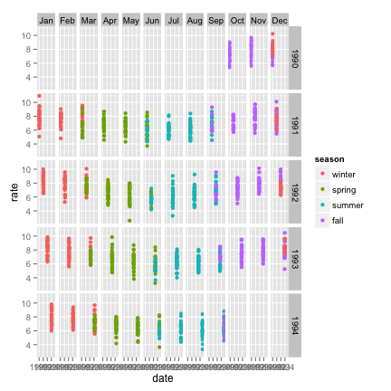 

rgl: Three Dimensional Data
===

```r
library(rgl)
N <- 100
x <- runif(N, min=-10, max=10)
y <- runif(N, min=-10, max=10)
z <- 10 + 1.3 * x + 2.1*y
plot3d(x,y,z)
```

References
===
* Wickham, H. ggplot2: Elegant Graphics for Data Analysis (2009)
* Wilkinson L and Wills D. The Grammar of Graphics (2005)
* Chang W. R Graphics Cookbook (2013)
* [ggplot cheatsheet](http://zevross.com/blog/2014/08/04/beautiful-plotting-in-r-a-ggplot2-cheatsheet-3/)
